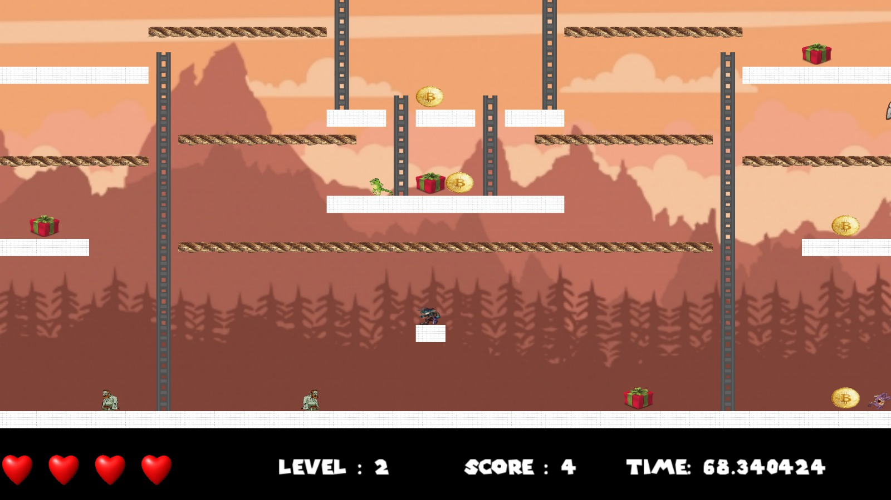
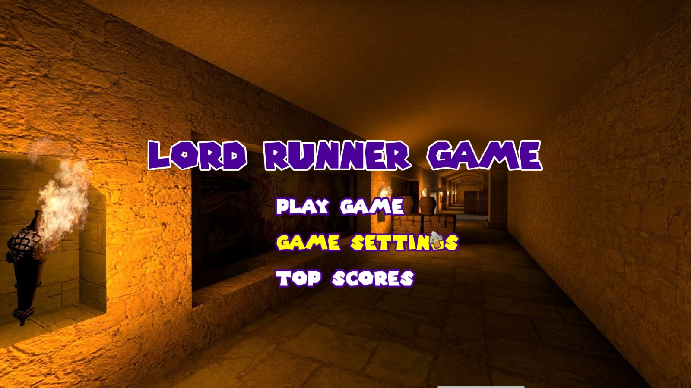
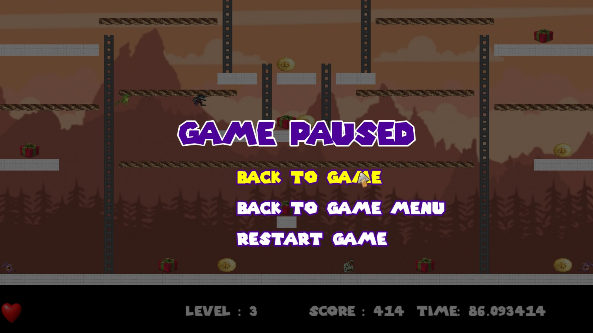
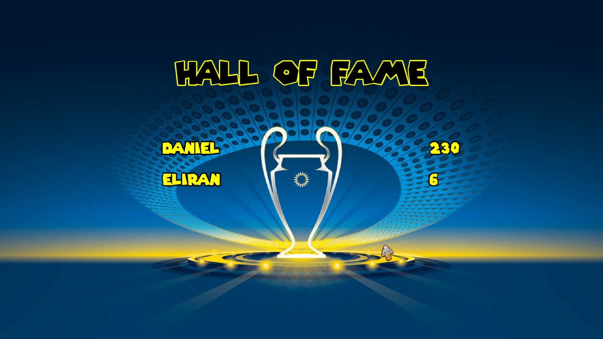

# Lord Runner sfml
**Authors:** Daniecl cohen & David mamman
# Screenshot Game
      
<table align="center">
  <tr>
    <td>
      
    </td>
    <td>
      
    </td>
  </tr>
    <tr>
    <td>
      
    </td>
	<td>
      
    </td>
  </tr>
</table>
      
